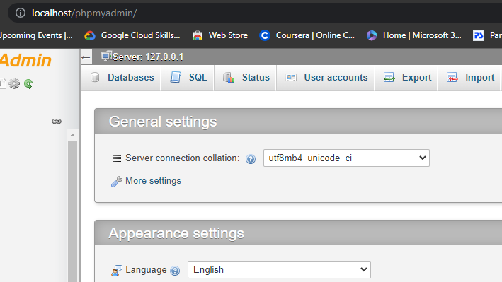
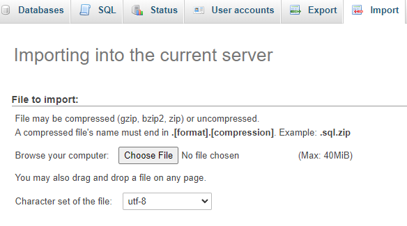
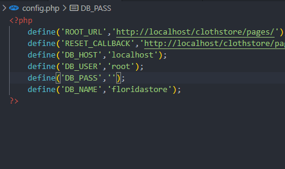

# Fictional Florida Clotheline Store
Fictional Clothline store website is a fictional store that sells high end clothes and jewerly. It wants to be able to let their employees login and add customers to their mailing list that is usually generated as a CSV file. They would also loved to search for the address of their customers using a search interface above the input form.

 
<b><i>A copy of this project can be found on  </i></b> 

[github.com/tiprock-network](https://github.com/tiprock-network/floridaclothstore-customer-addresslist.git)

Contact: lowiti@kabarak.ac.ke
## Technologies Utilized in this small project
* Php
* Xampp as a web server and host for MySQL
* Javascript (for an interactive website and also to send requests to the server), HTML, CSS
* Composer to import necessary dependencies required
* PHPmailer - used to send reset links to emails (the reset links are valid for about 10 minutes)

## Instructions
Before we can set up the database, we should make sure that the XAMPP Apache Server and MySQL and Tomcat are turned on in order to provide a local server environment.
### Setting up the database:
* First, go to <b><i>/database</i></b>.
* Confirm if the <b><i>floridastore.sql</i></b> is present.
* After which you will need to go to XAMPP by going to your browser paste the URL: <b><i>localhost/phpmyadmin</i></b>.

* On the dashboard look for import, and import <b><i><u>floridastore.sql</u></i></b> as the database.

* Hit the <b>Go</b> button below and you are done importing the database.

### Configuring the config file
In order to connect to the database the HOSTNAME, USER, PASSWORD & DATABASE need to be specified. In this case, since we are using XAMPP then we will add the following parameters as follows respectively: 'localhost', 'root','<i><b><u>add_your_password</u></b></i>', 'floridastore'.

If your XAMPP MySQL user account does not have a password, leave it blank. Now to do all the explained we navigate as follows, in the directory we follow the path <i><b>/config/config.php</b></i>. Open the file and replace all the values as shown above.

### Running the project
To run the project, make sure the whole folder(clothstore) has been transferred to the folder <b>htdocs</b> located at: <u><i><b>C:\xampp\htdocs</b></i></u>

Now to run the main page of the project in our browser we shall run this URL in the browser: [Click here to open Clothstore](http://localhost/clothstore/pages/)

